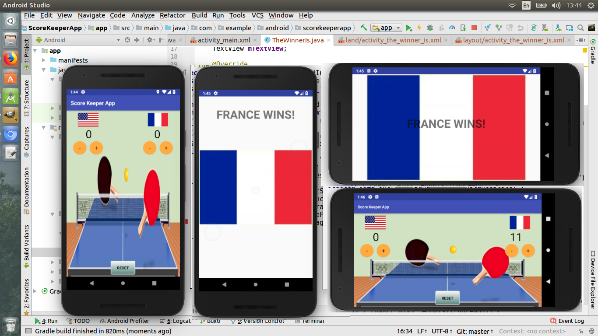

# ScoreKeeperApp
This is an Udacity/Google Android Basics Nano-Degree program project submission.
This project is aimed to show the capability of:
 - Adding button code
 - Updating views
 - Properly scoping variables
 - Finding views by their ID
 
 
 
 Thank you to the Sandy Pines Recreational Community for the background photo.
